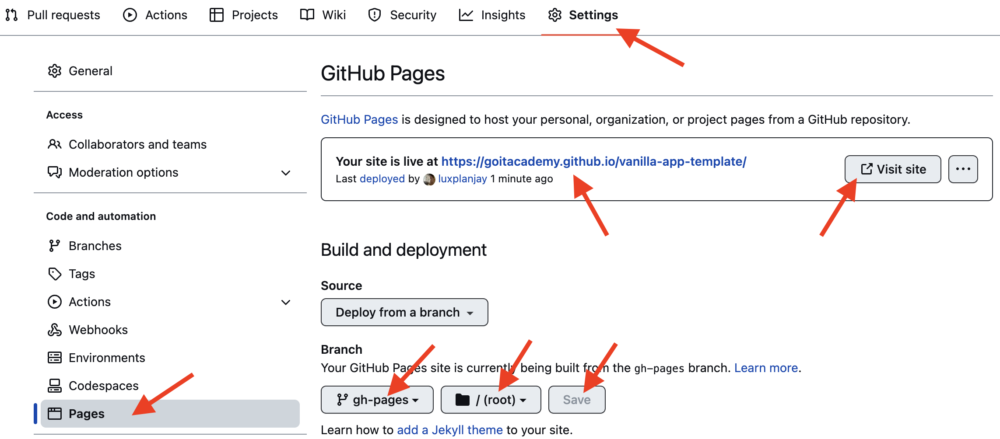

# Home work 10. Асинхронний JavaScript і проміси

Цей проект було створено за допомогою [готової збірки Vite](https://github.com/goitacademy/vanilla-app-template). Для знайомства та налаштування
додаткових можливостей [звернись до документації](https://vitejs.dev/).

## 1. Таймер зворотного відліку

Використовуй бібліотеку [flatpickr](https://flatpickr.js.org/getting-started/) для того, щоб дозволити користувачеві кросбраузерно вибрати кінцеву дату і час в одному елементі інтерфейсу. Для того щоб підключити CSS код бібліотеки в проєкт, необхідно додати ще один імпорт, крім того, що описаний в документації.
// Описаний в документації
``import flatpickr from "flatpickr";``
// Додатковий імпорт стилів
``import "flatpickr/dist/flatpickr.min.css";``

Для відображення повідомлень користувачеві, замість window.alert(), використовуй бібліотеку [iziToast](https://marcelodolza.github.io/iziToast/). Для того щоб підключити CSS код бібліотеки в проєкт, необхідно додати ще один імпорт, крім того, що описаний у документації.

// Описаний у документації
``"import iziToast from "izitoast";``
// Додатковий імпорт стилів
``import "izitoast/dist/css/iziToast.min.css";``


## 2. Генератор промісів


----------

#### Деплой

Продакшн версія проекту буде автоматично збиратися та деплоїтись на GitHub
Pages, у гілку `gh-pages`, щоразу, коли оновлюється гілка `main`. Наприклад,
після прямого пуша або прийнятого пул-реквесту. Для цього необхідно у файлі
`package.json` змінити значення прапора `--base=/<REPO>/`, для команди `build`,
замінивши `<REPO>` на назву свого репозиторію, та відправити зміни на GitHub.

```json
"build": "vite build --base=/<REPO>/",
```

Далі необхідно зайти в налаштування GitHub-репозиторію (`Settings` > `Pages`) та
виставити роздачу продакшн версії файлів з папки `/root` гілки `gh-pages`, якщо
це не було зроблено автоматично.



#### Статус деплою

Статус деплою крайнього коміту відображається іконкою біля його ідентифікатора.

- **Жовтий колір** - виконується збірка та деплой проекту.
- **Зелений колір** - деплой завершився успішно.
- **Червоний колір** - під час лінтингу, збірки чи деплою сталася помилка.

Більш детальну інформацію про статус можна переглянути натиснувши на іконку, і в
вікні, що випадає, перейти за посиланням `Details`.


#### Жива сторінка

Через якийсь час, зазвичай кілька хвилин, живу сторінку можна буде подивитися за
адресою, вказаною на вкладці `Settings` > `Pages` в налаштуваннях репозиторію.
Наприклад, ось посилання на живу версію для цього репозиторію

[https://goitacademy.github.io/vanilla-app-template/](https://goitacademy.github.io/vanilla-app-template/).

Якщо відкриється порожня сторінка, переконайся, що у вкладці `Console` немає
помилок пов'язаних з неправильними шляхами до CSS та JS файлів проекту
(**404**). Швидше за все у тебе неправильне значення прапора `--base` для
команди `build` у файлі `package.json`.

### Як це працює


1. Після кожного пуша у гілку `main` GitHub-репозиторію, запускається
   спеціальний скрипт (GitHub Action) із файлу `.github/workflows/deploy.yml`.
2. Усі файли репозиторію копіюються на сервер, де проект ініціалізується та
   проходить лінтинг та збірку перед деплоєм.
3. Якщо всі кроки пройшли успішно, зібрана продакшн версія файлів проекту
   відправляється у гілку `gh-pages`. В іншому випадку, у лозі виконання скрипта
   буде вказано в чому проблема.
